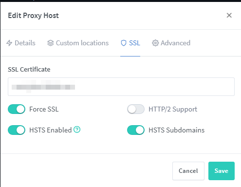

# docker-compose-notolac

This guide will explain you how to add custom Security Header in Nginx Proxy Manager

Before we begin, how to implement or add custom Security Header in Nginx Proxy Manager let's look at what is Web Application Headers and why it is important

WTF Security Header?
The Web Application Headers risk vector, analyzes security-related fields in the header section of communications between users and an application. They contain information about the messages, determine how to receive messages, and how recipients should respond to a message.

Much like a business letterhead, headers explain where the message is going and who it’s from, date sent, what type of message it is, and other configuration options. They're included in all back-and-forth communications between applications. Web servers and web-connected applications must conform to a certain set of language (communication) standards when sending information over the Internet. These language definitions are called “protocols.”

Web Application Headers cover security risks posed to an organization's application users through Hypertext Transfer Protocols (HTTP) headers. HTTP defines the way a website should respond when it can’t find something, if it can find something, or something was temporarily moved. For example, the “404” page (page not found error) can be understood by your web browser thanks to the HTTP standard. Otherwise, web programmers might pick obscure numbers or other ways to tell you that a page is not found. Your browser will then have to guess.

Required headers are important for preventing communication attacks, between applications, from succeeding. Using proper Web Application Headers over the Internet ensure communications are robust against attacks that are designed to take advantage of ambiguity (communication details that are not explicitly defined)

So What is the Risks?
Correctly configured headers protects against malicious behavior, such as man-in-the-middle (MITM) and cross-site scripting (XSS) attacks, and prevents attackers from eavesdropping and capturing sensitive data, such as credentials, corporate email, and customer data.

Now, Let's See how to add Headers in Nginx Proxy Manager
Due to a bug it's impossible to add Security Headers to NGINX Proxy Manager.
however, Use this workaround to fix this issue:

Step 1 : Create a file called \_hsts.conf in your proxy-manager directory and copy paste below code.

Step 2. Create a volume to this file (read-only)

Docker CLI
Volume location depends on Docker image.

Image: jlesage/nginx-proxy-manager

-v /PROXY-PATH/\_hsts.conf:/opt/nginx-proxy-manager/templates/\_hsts.conf:ro
Image: jc21/nginx-proxy-manager

-v /PROXY-PATH/\_hsts.conf:/app/templates/\_hsts.conf:ro
Docker Compose
Volume location depends on Docker image.

Image: jlesage/nginx-proxy-manager

volumes: - ./\_hsts.conf:/opt/nginx-proxy-manager/templates/\_hsts.conf:ro
Image:"jc21/nginx-proxy-manager

volumes: - ./\_hsts.conf:/app/templates/\_hsts.conf:ro
Step 3.
Go to NGINX Proxy Manager, click Edit and go to the tab SSL.
Enable and/or re-enable Force SSL, HSTS Enabled and HSTS Subdomains.

Done, you have added custom security headers to your website, you can verify the settings  
with https://securityheaders.com

Original Web ---->> https://geekscircuit.com/nginx-proxy-manager/ <<----
